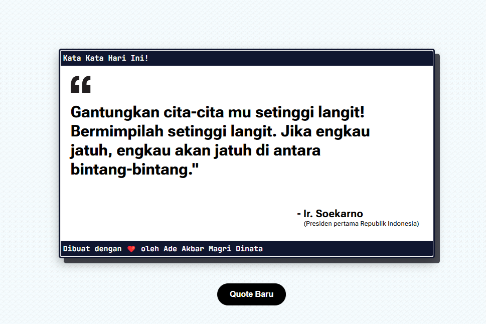

# Quote node.js

## Deskripsi
Quote node.js adalah aplikasi berbasis web yang akan menampilkan quote dari beberapa tokoh terkenal.

## Screenshot


## Cara Instalasi
```bash
git clone https://github.com/adeak-bar25/Quote-node.js
npm install express
node app.js
```

## Teknologi yang Digunakan
- HTML
- CSS
- JavaScript (Node.js)


## 👥 Kontributor
- [Ade Akbar Magri Dinata](https://github.com/adeak-bar25) - Developer & Desainer

## 📄 Lisensi
Proyek ini dilisensikan di bawah [MIT License](LICENSE).

Background Pattern pada proyek ini disediakan oleh [Subtle Patterns by Toptal](https://www.toptal.com/designers/subtlepatterns/)

---

Dibuat dengan ❤️ pada program 1 Sekolah 1 Programmer